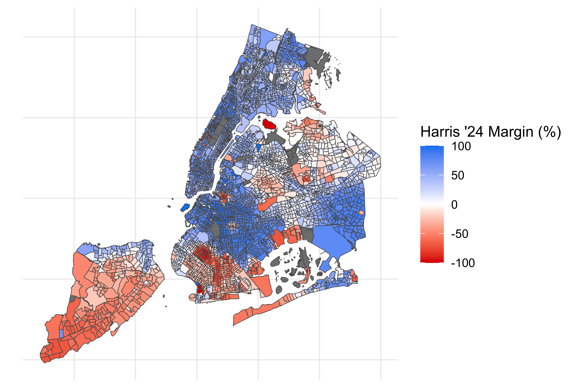
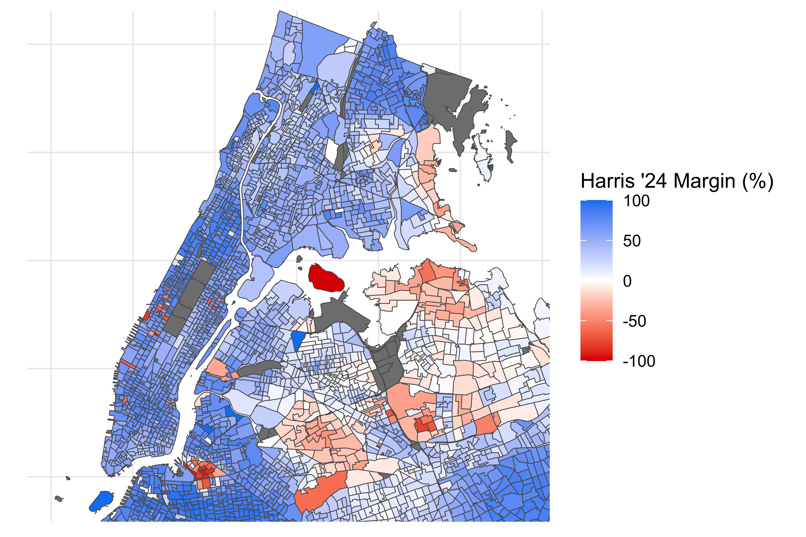
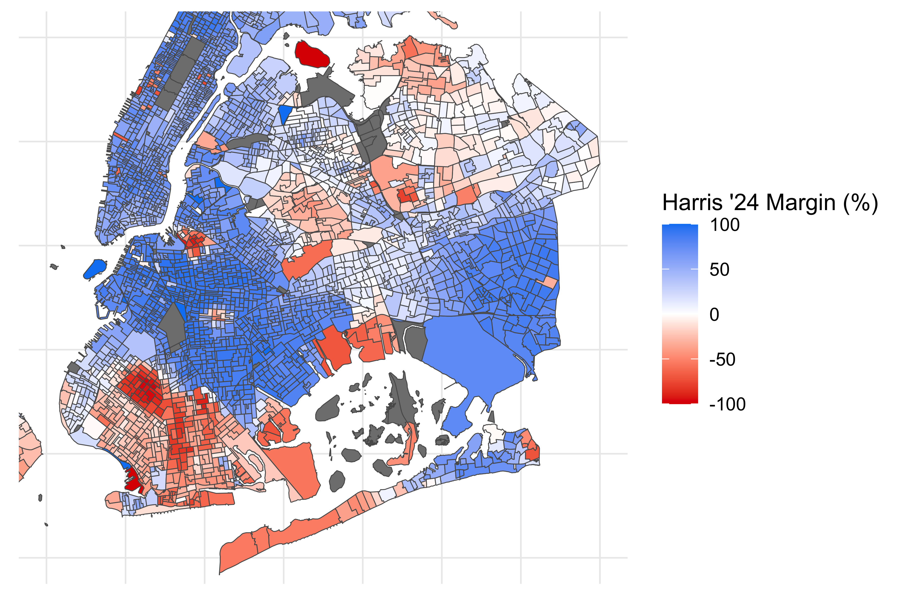
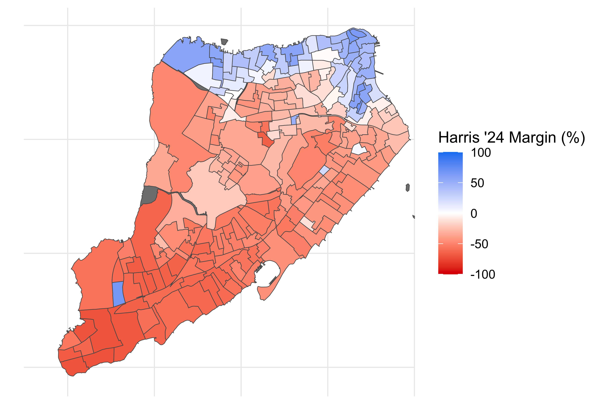

# New York City Election Results (2024 General Election)

## New York City 2024 Presidential Election Results by Precinct 

#### Full City View:

#### Manhattan and Bronx Zoom:

#### Brooklyn and Queens Zoom:

#### Staten Island Zoom:

## Data

### Election Results

Voting data on the level of Election District was sourced from New York City Board of Elections website ([https://vote.nyc/page/election-results-summary](https://vote.nyc/page/election-results-summary)). Re: Citywide President/Vice President Citywide, GENERAL - NOVEMBER 5, 2024.

* [Rawdata.csv](Rawdata.csv): Download from the NYC BOE took place on January 14, 2025.
* [OrganizeData.R](OrganizeData.R): R code was use to parse the raw data into the following tables:
    * [ADED24.csv](ADED24.csv): Harris '24 and Trump '24 votes by precinct (AD/ED).
    * [ADEDremap.csv](ADEDremap.csv): List of precincts for which results were combined into another precinct.

### Precinct Geospatial Data

Geospatial data on Election Districts was pulled from the New York City Open Data portal on December 1, 2024 ([https://data.cityofnewyork.us/City-Government/nyed/wwxk-38u4/about_data](https://data.cityofnewyork.us/City-Government/nyed/wwxk-38u4/about_data)) and uploaded as [nyed_24c](nyed_24c).

### Mapping

Geospatial data and election results were combined using R code (see [Mapping.R](Mapping.R)).

## Development Tips 
For preparing Markdown code, use [https://markdownlivepreview.com/](https://markdownlivepreview.com/)
